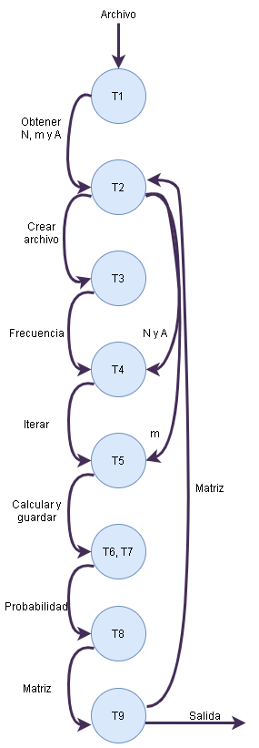
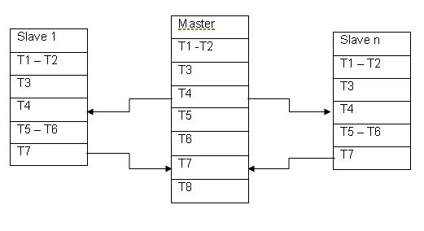

# Metodología PCAM

# Particionado

* T1, Definir el número perm que vamos a permutar
* T2, Calcular el número de permutaciones necesarias del número perm
* T3, Definir un vector desde uno hasta perm
* T4, Crear intervalo de permutacion que seran calculados en cada procesador
* T5, intercambiamos los valores en el vector entre los rangos dados
* T6, invertir el orden de los valores del vector desde el valor dado hasta el final del arreglo
* T7, Almacenar en un vector las permutaciones
* T8, Retornar el tiempo de ejecucion

# Comunicaciones

# Aglomeración

Las tareas que podemos agrupar son: [T1-T2] [T5-T6]

# Mapeo

Sincróno: [T4] por que crea un intervalo para cada permutación y la ejecución puede continuar
Asincronico: [T7] por que el maestro esta esperando que todos los procesadores calculen cada permutacion