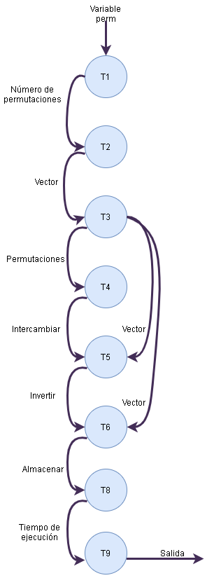

# Metodología PCAM

# Particionado

* T1, Cargamos los datos
* T2, Obtenemos dos enteros positivos N y m, también una matriz A que contiene k enteros entre 0 y 2N. A[j] representa el número de alelos recesivos para el factor j en una población de N individuos diploides.
* T3, Creamos un archivo para guardar la matriz final con las probabilidades de la perdida de alelos en la generación siguiente
* T4, Definimos una matriz con la frecuencia de cada número de alelos recesivos en la proxima generacion y en la actual
* T5, Lee los alelos en cada generación
* T6, calcula la probabilidad de frecuencia de alelos (En los tiempo t y t+1)
* T7, Almacena la probabilidad de frecuencia obtenida
* T8, Calcula en la matriz final el logaritmo de la frecuencia de alelos en la siguiente generación 
* T9, retorna la matriz

# Comunicaciones

# Aglomeración

Las tareas que podemos agrupar son: [T1, T2] - [T6, T7]

# Mapeo

Sincróno: [T5] por que lee el número de alelos en cada generación y la ejecución puede continuar
Asincronico: [T6, T7] por que el maestro esta esperando la probabilidad en el tiempo t y t+1 para continuar la ejecución